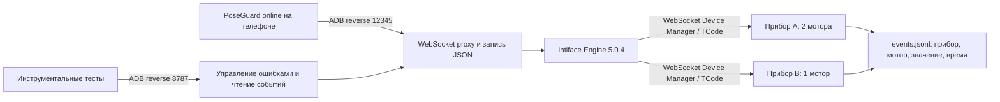

# Автоматические проверки PoseGuard на физическом устройстве

Проверки разделены по тому, что они измеряют: логика сессии, связь с настоящим Intiface, работа камеры и MediaPipe, работа Android-кодека. Во всех сценариях результат определяется утверждениями теста, а не ручным наблюдением экрана.

## Команды

```bash
source ./env.sh
pg quick-test offline
pg quick-test online
pg intiface-test
pg restart-test
pg camera-smoke offline
pg camera-smoke online
pg ui-test offline
pg release-check
```

Те же наборы выполняются на минифицированной release-сборке (`pg release-test`, `pg release-audit`, `pg release-check`); см. раздел «Release-конфигурация и R8».

Команды собирают нужные debug/test APK, устанавливают их через `adb install -r` и запускают `adb shell am instrument`. Флаг `--no-build` пропускает сборку, например `pg quick-test online --no-build`: он подходит только когда APK уже соответствует исходникам. `ANDROID_SERIAL` выбирает телефон. Отчёты, crash buffer и команды Intiface записываются в отдельную папку `artifacts/device-*` каждого запуска.

Для короткой проверки конкретного поведения доступны классы или отдельные методы:

```bash
pg scenario offline 'SessionScenarioTest#slowDisplacementIsClassifiedAsDriftAndEmitsDriftCue' --no-build
pg scenario offline MediaScenarioTest --no-build
pg scenario online 'IntifaceSessionScenarioTest#pauseViolationZerosBackgroundAndThenRestoresIt' --no-build
pg scenario online 'IntifaceControllerScenarioTest#switchingStopsPreviousDeviceBeforeSignallingNewDevice' --no-build
```

Онлайн-сценарий автоматически получает стенд и ADB reverse; дополнительная проверка перезапуска в одиночный запуск не включается. После изменения кода используйте команду без `--no-build`.

Инструментальные тесты используют пакет `com.incident201.poseguard`; online и offline устанавливаются по очереди поверх одного приложения. `flock` предотвращает одновременные прогоны на одном телефоне. Скрипт сохраняет данные при установке, а сценарии сохраняют и восстанавливают настройки приложения. Проверка камеры выдаёт разрешение CAMERA, проверки Intiface на Android 17 — ACCESS_LOCAL_NETWORK. Эти разрешения остаются выданными после теста. Совместимость уже установленного APK с debug-подписью проверяет Android; скрипт не удаляет несовместимое приложение.

## Быстрые сценарии сессии

`SessionScenarioTest` запускает настоящий `GameViewModel` на Android. Он получает синтетические Bitmap и 33 landmarks через `registerCameraFrame()` и `processMediaPipeResults()`, поэтому выполняются сопоставление timestamps, стабилизация личности, сглаживание, трекер, штрафы, состояния, события аудио и итог сессии. Тест не записывает напрямую `HoldingPose` или `Success`.

Внутренний `SessionTiming` позволяет тесту подавать монотонное время и убрать ожидания стабилизации/обратного отсчёта. Публичный конструктор приложения сохраняет прежнее поведение: системное время, стабилизация 4 секунды и отсчёт 10 секунд. Задержки Intiface остаются реальными, чтобы проверить отмену импульсов и запоздалые команды.

| Сценарий | Проверяемый результат |
| --- | --- |
| Удержание стабильной позы | Success, корректный итог, нет нарушений, события начала и завершения аудио |
| Краткий dropout MediaPipe | Восстановление без нарушения и штрафа |
| Длительное исчезновение | Нарушение PersonDisappeared, Failed на лимите |
| Движение позы | Полный pipeline; медленное смещение отдельно классифицируется как Drift, быстрое движение как Motion; соответствующие события аудио |
| Штраф и cooldown | Таймер увеличивается; повторное нарушение в cooldown не засчитывается |
| Штрафы отключены | Нарушения учитываются без добавления времени |
| Остановка и новая сессия | Старые нарушения и итог сбрасываются, новая сессия может завершиться |
| Камера перестала отдавать кадры | Failed вместо ложного Success на дедлайне |
| Уход приложения в фон | Ожидание начала отменяется; активная сессия прекращается |
| Нет исходной позы | Удержание не начинается |
| Random timer | Используется выбранная длительность и формируется корректный итог |
| FaceToCamera / FaceAwayFromCamera | На кадрах без лица первый режим отклоняет сессию, второй допускает удержание |
| Face Detector не может получить crop | После timeout сессия прекращается как техническая ошибка без штрафа и обвиняющей аудиофразы |
| Штрафы по ступеням | Первое, второе, третье и последующие нарушения добавляют настроенное время; нарушение на лимите завершает сессию без штрафа |
| Стабилизация телефона | Движущийся телефон не покидает ожидание; неподвижность на весь период запускает отсчёт; движение перезапускает период; Stop отменяет ожидание |
| Подготовительный отсчёт | Отсчёт идёт в реальном времени с аудиоподсказками; Stop во время отсчёта не оставляет поздних переходов; устаревший кадр в конце отсчёта даёт Failed |

Проверки лица используют настоящий нативный Face Detector на синтетическом пустом изображении. Они не измеряют точность распознавания лица человека.

`SettingsScenarioTest` проверяет на настоящих SharedPreferences, что настройки каждого типа (enum по имени, числа, строки, фразы TTS, PCM, параметры Intiface, таймер) переживают перезапуск процесса, а смена языка меняет тексты статусов для всех шести языков. В release это же проверяет, что R8 не повредил enum и data class, которые читаются через `valueOf`.

`AppFlowScenarioTest` (LargeTest, `pg ui-test`) проходит путь пользователя в настоящей `MainActivity` только через то, что видно на экране, без обращения к внутренним классам: первый запуск с выбором языка и onboarding до главного экрана, отсутствие onboarding после пересоздания Activity, Start → Stop возвращает главный экран в Idle, изменение настройки на экране настроек и выход назад.

`MediaScenarioTest` кодирует синтетические изображения в MP4 через настоящие MediaCodec/MediaMuxer, проверяет AVC-дорожку, размеры, несколько samples, монотонность PTS и ускорение времени в 10 раз. MediaMetadataRetriever декодирует видео; цвет кадра подтверждает, что записано поданное изображение. Проверяется повторная запись, пустая запись, discard, release, отсутствие оставшихся файлов и игнорирование кадров после release. Временные видео удаляются.

## Стенд Intiface



Сервер использует официальный WebSocket Device Manager и реальный протокол Buttplug v3, которым пользуется текущий Java-клиент. Устройство принимает TCode-команды вроде `V060` и `V160`; проверки подтверждают команду на выходе сервера, а не только UI-статус или отправленный запрос. Bluetooth, serial, реальные моторы и Intiface GUI в стенде не используются.

`IntifaceControllerScenarioTest` проверяет:

- Discovery двух приборов, различное количество моторов, ограничение силы диапазоном 0–1, тестовые импульсы и остановку.
- Ручное отключение с обнулением, новый поиск и повторное подключение.
- Переключение: остановка A до подачи сигнала B; положительные команды после переключения приходят только B.
- Сохранённую идентичность прибора при устаревшем индексе сервера; отсутствующий сохранённый прибор не заменяется другим.
- Физическое отключение виртуального устройства от Engine, очистку выбранного прибора и повторное обнаружение после подключения.
- Пустой поиск, неверный URL, timeout, Error сервера и восстановление после разрыва транспорта.
- Тестовый импульс ждёт незавершённую команду остановки, а повторные запросы теста не накапливаются в очереди.

Новые тесты воспроизвели и помогли исправить ошибку приложения: прежний прибор оставался с ненулевым выходом при переключении. Выбор теперь выполняется под тем же mutex, что команды вибрации, после подтверждённой остановки прежнего прибора. При ошибке остановки новый прибор не выбирается; ошибка передаётся в состояние контроллера. ViewModel сохраняет только фактически выбранный прибор; последовательные запросы выбора сериализованы. Также исправлен пропуск test pulse при занятом mutex команды остановки: отдельный mutex ограничивает повторные тесты, а сам импульс ожидает освобождения очереди команд.

`IntifaceSessionScenarioTest` проверяет связь с жизненным циклом сессии:

- Фоновый сигнал 20% → нарушение 70% → восстановление 20% → остановка 0%.
- Success прекращает фоновые сигналы.
- Потеря камеры прекращает сигналы без добавления нарушения.
- После остановки запоздалые callbacks не запускают вибрацию снова.
- Переключение при активной сессии переводит фон и сигналы нарушений на B, обнуляя A.
- Отключение Intiface в середине эффекта отменяет поздние сигналы, продолжая игровую сессию.
- Режим Pause: нулевой выход, затем восстановление фона; режим Pulse: несколько включений/выключений.
- Терминальное нарушение проигрывает настроенный эффект и не восстанавливает фон.
- Нарушения движения и правила лица запускают настроенный сигнал.
- Техническая ошибка Face Detector прекращает фон без штрафа и наказующего сигнала.

`IntifaceRestartScenarioTest` выполняется отдельными вызовами instrumentation. Первый сохраняет выбор B через настоящий ViewModel и UI; скрипт выполняет `adb shell am force-stop`, проверяет отсутствие процесса; второй открывает настоящую MainActivity в новом процессе. Обычная логика CameraScreen восстанавливает B автоматически, сессия остаётся Idle, положительных сигналов нет до явного тестового импульса. Изначальные настройки сохранены в приватном файле и восстанавливаются третьим вызовом, в том числе при ошибке через cleanup. Этот сценарий входит в `quick-test online` и `intiface-test`, отдельно запускается через `restart-test`.

Тесты online требуют явного аргумента `poseguardIntiface=true`, который добавляют `pg quick-test online` и `pg intiface-test`. Обычный запуск инструментальных тестов без стенда пропускает эти классы. Скрипт автоматически поднимает и останавливает стенд, устанавливает ADB reverse и восстанавливает прежние mappings. Если уже запущен `pg intiface`, используется он.

Для ручного исследования протокола:

```bash
pg intiface
# другой терминал:
pg adb reverse tcp:12345 tcp:12345
curl http://127.0.0.1:8787/events
curl -X POST -H 'Content-Type: application/json' \
  -d '{"mode":"reject-next-scalar"}' http://127.0.0.1:8787/fault
```

Режимы: `normal`, `no-devices`, `reject-next-scalar`, `timeout-next-scalar`, `disconnect-next-scalar`, `delay-next-scalar`. `POST /reset` восстанавливает оба виртуальных прибора, очищает наблюдения и сбрасывает ошибку. Для отключения/подключения прибора: `POST /device` с JSON `{"device":"B","connected":false}` или `true`. Клиентский proxy и HTTP control слушают localhost. В текущей сборке Engine порт WebSocket Device Manager 54817 слушает все интерфейсы; он существует только пока работает стенд. Шаблон содержит определения двух тестовых приборов. Изменяемая сервером копия конфигурации хранится в `artifacts`, исходный шаблон сохраняется.

Механизм виртуального устройства описан в [официальном руководстве Buttplug](https://buttplug.io/docs/dev-guide/inflating-buttplug/devices/websocket-device-manager/); зафиксирована [сборка Engine 5.0.4](https://github.com/buttplugio/buttplug/releases/tag/intiface-engine-5.0.4).

## Release-конфигурация и R8

Release-сборка отличается от debug минификацией (R8), сжатием ресурсов и обфускацией. Раньше R8 ломал MediaPipe (JNI, protobuf, Flogger) и Buttplug/Jetty (JSON и аннотации по именам классов), поэтому `minifyReleaseWithR8` и debug-прогон ничего не гарантируют: поломка проявляется только при выполнении. Проверки release состоят из трёх слоёв.

```bash
pg release-audit [offline|online|both]   # production APK: статический аудит + запуск на телефоне
pg release-test online [all|core|camera|ui|intiface|restart] [--no-build]
pg release-check                          # аудит + все наборы на release для обоих flavor
```

**1. Аудит production-APK** (`release-audit`). Собирается ровно тот APK, который попадёт к пользователю, с настоящими правилами проекта и без добавок для тестов. Проверяется: не debuggable, minSdk/targetSdk, разрешения flavor (в offline нет INTERNET, ACCESS_NETWORK_STATE и ACCESS_LOCAL_NETWORK), подпись, выравнивание ZIP для страниц 4 и 16 КБ, модели `.task`/`.tflite` и `libmediapipe_tasks_jni.so` хранятся без сжатия, строки для всех шести языков остались после сжатия ресурсов, сохранены имена классов MediaPipe/Flogger и (online) Buttplug/Jetty, в offline нет кода Jetty/Buttplug, код приложения действительно обфусцирован. Затем APK устанавливается, получает разрешения, запускается, и через 10 секунд проверяется, что процесс жив и в crash buffer нет записей PoseGuard; число обработанных MediaPipe кадров в logcat выводится справочно. Скриншоты не сохраняются: они захватывают всё, что открыто на телефоне.

**2. Сценарии на release-APK** (`release-test`). Те же наборы `core`, `camera`, `ui`, `intiface`, `restart` выполняются на минифицированном, не debuggable APK, установленном поверх debug-сборки. Перед запуском скрипт проверяет, что APK действительно не debuggable. AGP собирает тестовый APK отдельным R8-проходом по маппингу приложения, поэтому тесты вызывают обфусцированные классы так же, как и в debug.

Тестовому раннеру и правилам Compose нужны классы, которые приложение не использует, поэтому R8 вырезает их из APK, а тестовый APK ожидает их там. Для этого release-сборка тестов получает один дополнительный вход R8, `tools/proguard/instrumentation-keep.pro`: библиотеки `androidx.**`, `kotlin.**`, `kotlinx.**` остаются как есть, а код `com.incident201.poseguard.**`, который вызывают сценарии, не удаляется, но по-прежнему обфусцируется. Все правила проекта действуют полностью, MediaPipe, protobuf, Flogger, Jetty и Buttplug минифицируются без исключений; в production-APK этой добавки нет. Подключает её `tools/gradle/release-tests.init.gradle` вместе с `testBuildType = release`, файлы проекта не меняются. Release подписывается открытым debug-ключом репозитория под псевдонимом `upload` (`tools/release-env.sh`), поэтому устанавливается поверх debug-сборки без потери данных; настоящие release-ключи не читаются и не создаются.

Сценарии не используют рефлексию по именам полей: обфускация переименовывает их, поэтому исполнители ищутся по типу.

**3. Доказательство, что проверка ловит R8-ошибки.** Из `proguard-rules.pro` временно удалялись правила, ради которых они написаны:

| Удалённое правило | Результат на release | Результат на debug |
| --- | --- | --- |
| `-keep class io.github.blackspherefollower.buttplug4j.protocol.** { *; }` | Падают сценарии `IntifaceControllerScenarioTest` | Не проявляется |
| `-keep class com.google.mediapipe.framework.** { *; }` | Процесс падает при инициализации MediaPipe | Не проявляется |

После проверки файл правил возвращён к исходному.

Не покрыто в release: Face Detector на настоящем лице (сценарии работают на синтетическом пустом изображении) и оставшиеся различия между production-APK и APK для тестов выше. Когда сценарий падает, скрипт сохраняет в папку запуска `crashes-*.log` и `logcat-*.log` только за время этого запуска, а не весь crash buffer телефона.

## Реальная камера и границы покрытия

`CameraSmokeTest` открывает настоящую Activity и CameraX, ждёт результата от настоящего CPU/Full MediaPipe, переводит Activity в фон и обратно, пересоздаёт её и подтверждает получение кадров. Второй сценарий запускает игровую сессию с обычными задержками, записывает реальные кадры камеры во время countdown, дожидается итогового экрана, проверяет доступность кнопки сохранения и декодирование MP4, затем закрывает итог и проверяет удаление временного видео. Человек в кадре не требуется: отсутствие исходной позы завершает подготовку с итогом Failed; при найденной позе тест прерывает активную сессию через потерю камеры. Телефон должен лежать неподвижно для обычной стабилизации гироскопом. Оба сценария помечены LargeTest и запускаются отдельно через `pg camera-smoke`.

Ожидания внешних CameraX/MediaPipe callbacks в Compose-тесте используют `waitUntil`, чтобы UI продолжал выполнять recomposition. Обычный цикл с `Thread.sleep` внутри ComposeTestRule может остановить обновление UI; это поведение описано в [официальной документации синхронизации Compose](https://developer.android.com/develop/ui/compose/testing/synchronization).

Быстрые сценарии не заменяют проверку точности зрения, реального гироскопа, GPU fallback, слышимости TTS/PCM, управления конкретным Bluetooth-устройством или кнопок всех локализаций. Для расширения покрытия наиболее полезны:

| Следующая проверка | Как автоматизировать |
| --- | --- |
| Полный UI-путь сессии с человеком в кадре | onboarding, настройки и Start/Stop уже проходят через настоящую Activity (`AppFlowScenarioTest`); остаются таймер и итоговый экран при удержании позы, нужен воспроизводимый источник кадров с человеком |
| Качество MediaPipe и калибровка | Набор разрешённых видеозаписей и ожидаемых исходов; replay кадров через тот же camera/inference pipeline |
| GPU и CPU fallback | Параметризованные smoke-тесты обоих delegate и ошибки инициализации |
| Сохранение timelapse через системный picker | Проверка SAF-провайдера, выбора каталога, отмены сохранения и результата записи в выбранный URI |
| Жизненный цикл и утечки | 20–50 стартов/остановок/пересозданий, проверки CameraX, executors, памяти через dumpsys, времени кадра через Perfetto |
| Звук | Отдельные проверки AudioTrack/MediaPlayer/TTS callbacks; события аудио уже проверяются, слышимость требует отдельного критерия |
| Реальное железо Intiface | Периодический прогон с выделенным устройством; этот слой проверяет Bluetooth и особенности firmware |

GitHub Actions продолжает выполнять JVM-тесты, lint и R8 для обоих вариантов; компиляция инструментальных APK добавлена в CI. Исполнение на физическом телефоне производится через этот стенд; для регулярной CI-проверки потребуется отдельный runner с подключённым тестовым телефоном.

## Проверено в этом окружении

Pixel 10 Pro XL, Android 17 / API 37, USB ADB.

**Статические проверки.** `verify` с принудительным перезапуском всех задач завершился успешно: 101 JVM-тест в offline и 100 в online (по одному прежнему ignored screenshot), lint, debug и AndroidTest APK, R8 для обоих flavor. Новые JVM-тесты: `SettingsPersistenceTest` (значения по умолчанию, сохранение каждой настройки, миграции, повреждённые значения, ограничение диапазонов; тест падает, если в `GameSettings` добавлено поле, которое он не проверяет), `OfflineFlavorTest` (в offline нет сетевых разрешений, заглушка Intiface не подключается) и `OnlineFlavorTest`. Отключение сохранения одной настройки в `GameViewModel` и удаление вызова из `customize()` по отдельности приводят к падению этих тестов; исходный код после проверки восстановлен.

**Debug на телефоне.** Базовый прогон до изменений: 19 offline-сценариев, 41 online-сценарий с проверкой восстановления прибора после force-stop, камера и timelapse на обоих flavor. После добавления сценариев: offline `core` 29 из 29, `ui` 4 из 4. Новые сценарии стабилизации проверены на чувствительность: если движение не сбрасывает таймер неподвижности, `movementRestartsTheStillnessPeriod` падает.

**Release (R8) на телефоне.** `pg release-audit both`: все статические проверки production-APK пройдены для offline и online, оба APK запускаются на телефоне и остаются живыми, MediaPipe обрабатывает кадры. `pg release-test`: offline `core` 29 из 29, `camera` 2 из 2, `ui` 4 из 4 (при последовательном повторении 6 раз подряд без сбоев); online `all`: 51 сценарий `core`, `camera` 2, `ui` 4 и три фазы проверки перезапуска, всё пройдено. Установленный APK не debuggable (`flags=0x0`), классы приложения обфусцированы по `mapping.txt`.

**Известное наблюдение.** В одном из первых release-прогонов `all` для offline процесс упал с `SIGBUS (BUS_ADRERR)` в `libmediapipe_tasks_jni.so`, поток `drishti`, через 6 секунд после запуска процесса, в UI-сценарии первого запуска сразу после установки APK. Повторить не удалось: 3 повтора `ui`, 3 повтора пары `camera` и `ui` и последующий полный online-прогон прошли без сбоев. Причина не установлена; обращение по адресу далеко за пределами отображённого буфера говорит о нативной проблеме MediaPipe или об отображении файла из APK, а не о Java-слое. При повторении скрипт теперь сохраняет `crashes-*.log` и `logcat-*.log` за время запуска.

Логи этой проверки в `artifacts/`: `verify-final-20261010.log`, `release-offline-all.log`, `release-online-all.log`, `release-audit-run2.log`, `mutation-buttplug.log`, `mutation-mediapipe.log`; данные каждого запуска находятся в `artifacts/device-*` и `artifacts/release-audit-*`.
